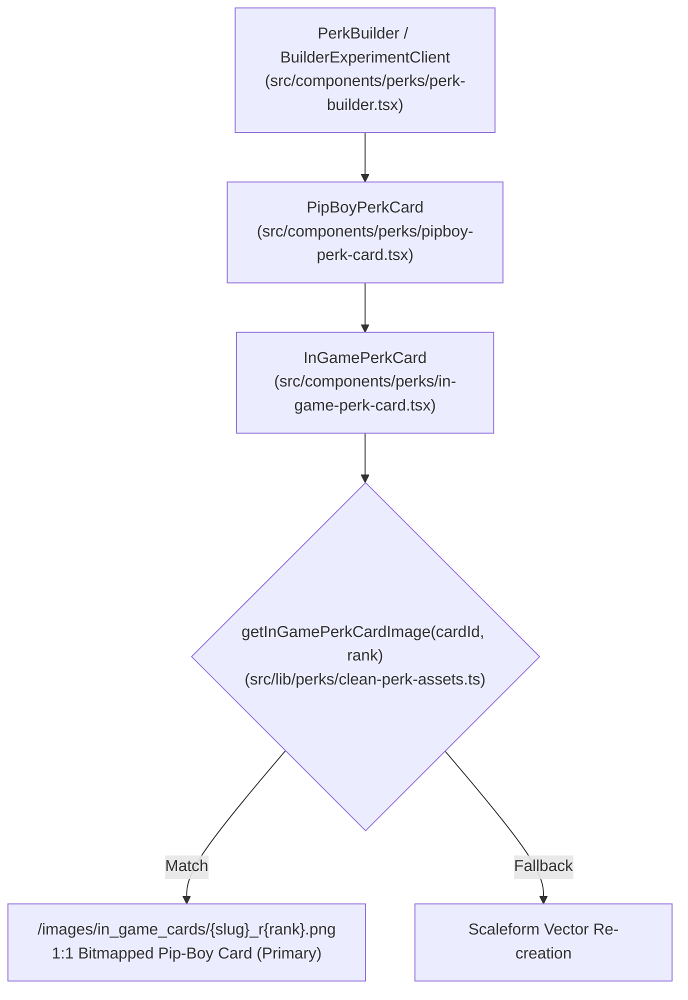

# ☢️ AGY Master Directive: 1:1 In-Game Perk Card Ingestion & Architecture

> **Target Systems**: Antigravity Desktop Agent (AGY), Vera AI Subagents, R.O.L.L. Web Platform (`fallout76.wiki`)  
> **Status**: Active & Authoritative  
> **Source Datamine**: Official `SeventySix.esm` (Live Patch / Milepost Zero / 2026 Season Updates)

---

## 1. Executive Summary & Objective

All perk cards rendered across the R.O.L.L. platform—including the **P.E.R.K. Builder**, **Inspect Modal**, **Punch Card Machine**, and **Truth Wiki**—must strictly use the **1:1 bitmapped, Pip-Boy curved in-game cards** stored in `public/images/in_game_cards/`.

Legacy vector SVGs, unslanted wiki cutouts, and synthetic cover boxes are permanently deprecated. Every perk card in the game (Standard, Reworked, Ghoul, and Legendary) has been composited directly from authentic Bethesda source assets with working rank star ribbons, dynamic cost badge inpainting, and live patch descriptions.

---

## 2. Master Catalog & Asset Specifications

### 2.1 File Storage Locations
1. **Production Web Application**:  
   `public/images/in_game_cards/` (Served by Next.js at `/images/in_game_cards/`)
2. **Desktop Prototype & Agent Exchange**:  
   `/home/nathanw/Desktop/Agent_Exchange/clean_perk_assets/in_game_cards/`

### 2.2 Numerical Ingestion Totals
* **Total Unique Perk Cards**: **274 cards**
  * **Standard Perk Cards**: 245 cards (S: 37, P: 38, E: 40, C: 31, I: 36, A: 33, L: 30)
  * **Legendary Perk Cards**: 29 cards (26 classic + *Action Diet*, *Feral Rage*, *Nuclear Proliferator*)
* **Total Rank Tiers Rendered**: **578 discrete rank images** (`*_r1.png`, `*_r2.png`, etc.)
* **Total Verified Files**: **868 PNGs** per directory (includes rank files, unranked base aliases, and legacy route fallbacks).

---

## 3. Component Hierarchy & Layout Integration

All site layout rendering follows a strict 3-tier cascade:



### 3.1 Primary Component: `InGamePerkCard`
File: `src/components/perks/in-game-perk-card.tsx`

* **Aspect Ratio**: Locked to `aspect-[310/490]` to match native Pip-Boy proportions without letterboxing.
* **Resolution Pipeline**:
  ```typescript
  const inGameCardImage = getInGamePerkCardImage(cardId || name, rank);
  ```
* **Render Logic**:
  ```tsx
  {inGameCardImage && !imgError ? (
     setImgError(true)}
    />
  ) : ( ...fallback )}
  ```

### 3.2 Dynamic Rank Inspection
Right-clicking or tapping a perk card opens the **Perk Inspector Modal**. The inspector dynamically renders each rank by calling:
```typescript
const inGameInspectImage = getInGamePerkCardImage(cardId || name, inspectRankData.rank);
```
This guarantees that cycling through Rank 1, 2, 3, or 4 displays the exact corresponding bitmapped asset with updated cost numbers and filled star ribbons.

---

## 4. Reworked Perks & Legacy Redirection Rules

Bethesda's balance patches reworked several legacy perks into brand new mechanics. The table below outlines how these must be mapped:

| Official Game ID | Live Card Title | Replaced Legacy Perk | Native Base Asset | Base Cost |
| :--- | :--- | :--- | :--- | :---: |
| `bullet-storm` | **BULLET STORM** | `heavy_gunner` | `fo76-perk-bullet-storm.webp` | 1 |
| `tightly-wound` | **TIGHTLY WOUND** | `expert_heavy_gunner` | `fo76-perk-tightly-wound.webp` | 2 |
| `bringing-the-big-guns`| **BRINGING THE BIG GUNS**| `master_heavy_gunner` | `fo76-perk-bringing-the-big-guns.webp`| 3 |
| `heavy-hitter` | **HEAVY HITTER** | `master_slugger` | `fo76-perk-heavy-hitter.webp` | 3 |
| `knee-capper` | **KNEE-CAPPER** | `expert_slugger` | `fo76-perk-knee-capper.webp` | 2 |
| `bloody-mess` | **BLOODY MESS** | *(Updated mechanics)*| `fo76-perk-bloody-mess.webp` | 1 |

### 4.1 Strict Invariant: NEVER Draw Over Native Titles
* Official high-resolution Bethesda base webps **already exist** for all 5 reworked heavy/melee perks.
* **FORBIDDEN**: Never define these cards in synthetic override dictionaries that paste flat rectangles over title banners.
* **MANDATORY**: Always pull directly from `fo76-perk-{id}.webp`. The title banner and artwork must remain 100% untouched Bethesda art.

### 4.2 Legacy Compatibility Aliases
When saving card assets, `scripts/generate_all_standard_cards.py` automatically mirrors:
* `bullet_storm_r{N}.png` $\rightarrow$ `heavy_gunner_r{N}.png`
* `tightly_wound_r{N}.png` $\rightarrow$ `expert_heavy_gunner_r{N}.png`
* `bringing_the_big_guns_r{N}.png` $\rightarrow$ `master_heavy_gunner_r{N}.png`
* `heavy_hitter_r{N}.png` $\rightarrow$ `master_slugger_r{N}.png`
* `knee_capper_r{N}.png` $\rightarrow$ `expert_slugger_r{N}.png`

---

## 5. Multi-Rank Badge & Ribbon Engine Specifications

### 5.1 Standard Cards
* **Pip-Boy Slant**: Native baseline angle is **`+3.568°`** (parchment description text and badge must align to this rotation).
* **Seamless Badge Inpainting**:
  * Rotate badge crop by `-3.568°` to flat orientation.
  * Dilate dark number glyphs (`mean RGB < 175`, `alpha > 200`) using `ImageFilter.MaxFilter(7)`.
  * Inpaint solely within the dilated glyph area using median cream badge texture + subtle Gaussian noise ($\sigma = 1.5$).
  * Stamp new rank cost number using `RobotoCondensed-Bold` (size 54).
  * Rotate back by `+3.568°` with Gaussian-blurred change mask (`radius = 1.5`).
  * **Result**: Native cream paper texture, rounded bevel, and green border remain 100% intact. Zero rectangular seams.
* **Star Ribbon Progression**:
  * 1-Star Ribbon: Unmodified native ribbon.
  * 2-Star Ribbon: White star at `(451, 500)`, Dark star at `(445, 502)`.
  * 3-Star Ribbon:
    * Rank 1: 1 white, 2 dark at `(427, 496)` & `(457, 492)`.
    * Rank 2: 2 white, 1 dark.
    * Rank 3: 3 white stars.

### 5.2 Legendary Cards
* **Plate Slant**: Native gold banner slant is **`-8.9°`** (NOT -3.568°).
* **Text Inpainting**: Slanted bounding box `y ∈ [91, 174], x ∈ [45, 433]` erased with median plate texture + noise ($\sigma = 1.8$).
* **Star Rack**: 4-star rack cleanly stamped at `(165, 478)` using official Bethesda 4-star sprites (`lgn_stars_rank_1..4.png`).

---

## 6. Regeneration & Maintenance Commands

Whenever new patch data is datamined or cards are modified, AGY must run the following automated generation suite:

```bash
# 1. Regenerate all 29 Legendary cards across all 4 ranks
python3 scripts/generate_all_legendary_cards.py --force

# 2. Regenerate all 245 Standard cards across all ranks
python3 scripts/generate_all_standard_cards.py --force

# 3. Verify production compilation
npm run build
```

---

## 7. Mandatory AGY Desktop Agent Rules of Engagement

1. **Primary Asset Source**: Any UI displaying a perk card MUST query `getInGamePerkCardImage()` and display `/images/in_game_cards/${slug}_r${rank}.png`.
2. **Never Overwrite with SVGs**: Do not replace `InGamePerkCard` with the legacy SVG radar box renderer.
3. **Preserve Mechanical Storage Invariants**: In accordance with `sovereign-hdd-guard.md`, all card rendering and image generation scripts operate exclusively within the local project directory on the SSD (`/home/nathanw/Creative Direction/R.O.L.L/`). Never walk or write to `/run/media/nathanw/Library`.
4. **Dual Output Sync**: Any script generating card assets must write to both `public/images/in_game_cards/` AND `/home/nathanw/Desktop/Agent_Exchange/clean_perk_assets/in_game_cards/`.
