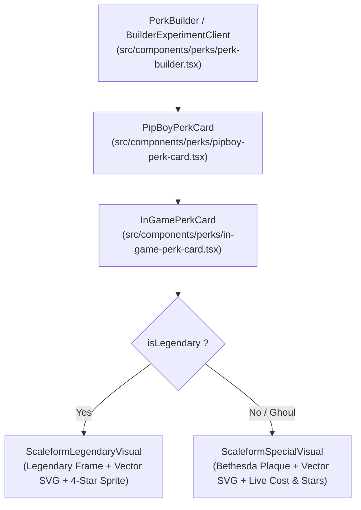

# ☢️ AGY Master Directive: 1:1 Flat Scaleform Vector Perk Card Architecture

> **Target Systems**: Antigravity Desktop Agent (AGY), Vera AI Subagents, R.O.L.L. Web Platform (`fallout76.wiki`)  
> **Status**: Active & Authoritative (Supersedes legacy raster PNG directive)  
> **Source Datamine**: Official `SeventySix.esm` (Live Patch / Milepost Zero / 2026 Season Updates)

---

## 1. Executive Summary & Objective

All perk cards rendered across the R.O.L.L. platform—including the **P.E.R.K. Builder**, **Inspect Modal**, **Punch Card Machine**, and **Truth Wiki**—strictly use the **1:1 Flat Scaleform Vector Architecture** (`ScaleformSpecialVisual` for Standard and Ghoul perks; `ScaleformLegendaryVisual` for Legendary perks).

### Why the Architecture Converged
Pre-rendered composite raster PNGs in `in_game_cards/` had overlapping multi-line descriptions and clipped header strings literally baked into their pixels from legacy compositor scripts (e.g. Thru-Hiker, Good With Salt, Tormentor). The Flat Scaleform Vector Architecture completely eliminates all text ghosting and double vision by dynamically compositing:
1. **Pristine Bethesda SPECIAL Plaques & Borders**: Unbaked high-resolution plaque textures from `public/images/clean_perk_assets/plaques/` with golden die-cut borders and genuine parchment grunge overlays.
2. **Lossless Vector Character Art**: 319 pure datamined vector SVGs from `public/images/perks_official/` preserving full fidelity at any display scale.
3. **Dynamic Browser Typography**: Flawless, sharp typography with live multi-rank costs, rank star racks, and patch descriptions.

Legacy raster folders (`public/images/in_game_cards/`, `public/images/in_game_curved/`, and `public/images/perks_official_wiki/`) are retired and safely archived. Total asset weight reduced from **340 MB down to 5.6 MB** (~98.4% payload optimization).

---

## 2. Master Catalog & Asset Specifications

### 2.1 File Storage Locations
1. **Vector SVGs (Character Illustrations)**:  
   `public/images/perks_official/*.svg` (319 SVGs, covering all 268 cards and gender variants)
2. **Clean Component Assets (Plaques, Frames, Textures)**:  
   `public/images/clean_perk_assets/`
   - `plaques/`: `strength_plaque.png`, `perception_plaque.png`, `endurance_plaque.png`, `charisma_plaque.png`, `intelligence_plaque.png`, `agility_plaque.png`, `luck_plaque.png`
   - `legendary/`: `legendary_frame_cropped.png`, `lgn_stars_rank_1..4.png`
   - `textures/`: `card_grunge.png`, `rank_ribbon.png`, `stars_rack.png`
3. **Safe Rollback Archive**:  
   `/home/nathanw/Desktop/Agent_Exchange/legacy_perk_bitmaps_backup.tar.gz` (331 MB archive of retired raster folders)

### 2.2 Numerical Catalog Totals
* **Total Unique Catalog Perks**: **268 perks** (100% vector SVG parity)
* **Standard Perk Cards**: 239 perks across S.P.E.C.I.A.L.
* **Legendary Perk Cards**: 29 perks
* **Total SVGs**: **319 files** (includes gender variants and live renames)

---

## 3. Component Hierarchy & Layout Integration

All perk card rendering follows a unified Scaleform cascade:



### 3.1 Primary Component: `InGamePerkCard`
File: `src/components/perks/in-game-perk-card.tsx`

* **Aspect Ratio**: Locked to `aspect-[310/490]` matching native Pip-Boy screen geometry.
* **Resolution Pipeline**:
  ```typescript
  const cleanForeground = getCleanPerkForeground(cardId || name, special, isFemale);
  ```
* **Render Logic**:
  ```tsx
  {isLegendary ? (
    <ScaleformLegendaryVisual
      displayName={displayName}
      rank={rank}
      maxRank={maxRank}
      description={description}
      cleanForeground={cleanForeground}
    />
  ) : (
    <ScaleformSpecialVisual
      displayName={displayName}
      special={special}
      cost={cost}
      rank={rank}
      maxRank={maxRank}
      description={description}
      cleanForeground={cleanForeground}
    />
  )}
  ```

### 3.2 Dynamic Rank Inspection
Right-clicking or tapping a perk card opens the **Perk Inspector Modal**. The inspector dynamically updates the preview card with live rank data:
```tsx
{isLegendary ? (
  <ScaleformLegendaryVisual
    displayName={displayName}
    rank={inspectRankData.rank}
    maxRank={maxRank}
    description={inspectRankData.description}
    cleanForeground={cleanForeground}
  />
) : (
  <ScaleformSpecialVisual
    displayName={displayName}
    special={special}
    cost={inspectRankData.cost}
    rank={inspectRankData.rank}
    maxRank={maxRank}
    description={inspectRankData.description}
    cleanForeground={cleanForeground}
  />
)}
```

### 3.3 Rank Label Space Calibration
To prevent truncation ellipsis (e.g. `RA...`) on compact mobile cards, the rank label format is:
```tsx
{maxRank > 1 ? `RK ${rank}/${maxRank}` : `RK 1`}
```

---

## 4. Dynamic Gender Variants (Vault Boy <-> Vault Girl)

Dynamic bidirectional gender swapping is natively supported via `isFemale`:

| Base Perk | Male Variant (`isFemale: false`) | Female Variant (`isFemale: true`) |
| :--- | :--- | :--- |
| **Action Boy / Girl** | `actionboy.svg` ("Action Boy") | `actiongirl.svg` ("Action Girl") |
| **Aquaboy / Aquagirl** | `aquaticconcealment.svg` ("Aquaboy") | `aquaticconcealmentgirl.svg` ("Aquagirl") |
| **Party Boy / Girl** | `partyboy.svg` ("Party Boy") | `partygirl.svg` ("Party Girl") |
| **Lady Killer / Black Widow** | `ladykiller.svg` ("Lady Killer") | `blackwidow.svg` ("Black Widow") |

---

## 5. Quality Assurance & Verification Suite

All modifications must pass the 4-tier quality gate:
```bash
npm run test         # Vitest unit test suite (13 test files, 90 tests)
npm run typecheck    # TypeScript compilation check (0 errors)
npm run lint         # ESLint style and safety audit (0 errors, 0 warnings)
npm run build        # Production Next.js build compilation
```

---

## 6. Mandatory Agent Directives

1. **Pure Vector Architecture**: Never re-introduce pre-rendered composite raster cards or scripts that bake text into image pixels.
2. **Canonical Resolver**: Always resolve character artwork via `getCleanPerkForeground(cardId, special, isFemale)` or `getPerkVectorArtUrl(cardId, special, isFemale)`.
3. **Deployment Pacing**: NEVER push commits or trigger deployments while a GitHub Actions or Cloudflare workflow is running.
