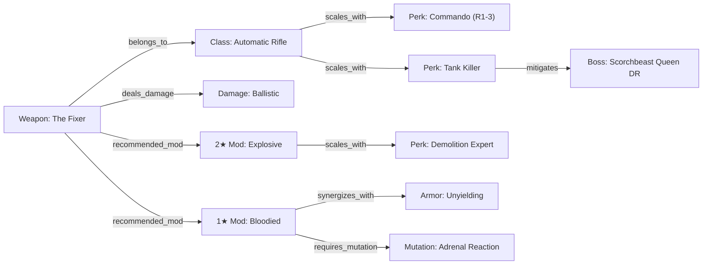

# ⚛️ R.O.L.L. — Architectural & Systems Upgrades from Sovereign Vault

> **Target Systems**: R.O.L.L. Platform (`fallout76.wiki`), B.U.I.L.D. Diagnostic Engine, Guides / Wiki, Discord Bot  
> **Source Systems**: Sovereign Vault Core (`/home/nathanw/sovereign_vault_ui/`), Semantic Vector Engine, Native Obsidian Graph-RAG  
> **Scope**: Structural architecture, graph engines, vector search, ingestion pipelines, and offline systems (zero raw data transfer).

---

## Executive Summary

A structural review of the **Sovereign Vault** (`sovereign_vault_ui`) reveals several battle-tested architectural systems that directly solve existing limitations in **R.O.L.L.**:
1. **Dynamic Synaptic Graph-RAG Engine**: Replacing R.O.L.L.'s hard-coded 7-weapon `synergy-engine.ts` with a multi-hop relational graph engine capable of mapping weapon classes, perk synergies, mod interactions, and boss mechanics.
2. **Hybrid Search Architecture (Dense ONNX Vector + Sparse FTS5 + Reciprocal Rank Fusion)**: Upgrading R.O.L.L.'s linear in-memory `/wiki` search to understand natural language conceptual queries (e.g. *"high ap regen sneak commando armor"*) without losing exact keyword precision.
3. **Autonomous Ingestion Sentinel & Mover Queue**: Replacing manual, one-off datamining scripts with a continuous watcher daemon for PTS and live patch drops.
4. **Companion Card & Sidecar Metadata Model**: Indexing raw datamined assets, Pip-Boy curved cards, and weapon models through lightweight metadata sidecars.
5. **Pip-Boy Radio Voice Interface (STT & TTS)**: Integrating local speech synthesis and recognition for hands-free query playback during gameplay.

---

## 1. Native Synaptic Graph-RAG & Synergy Engine

### The Opportunity in R.O.L.L.
In R.O.L.L. today, build synergy detection in [`src/lib/builder/synergy-engine.ts`](file:///home/nathanw/Creative%20Direction/R.O.L.L/src/lib/builder/synergy-engine.ts) relies on a static, hand-written dictionary mapping ~7 weapons (Fixer, Handmade, Railway, Cremator, Holy Fire, Gatling Plasma, Chainsaw) to perks. Furthermore, [`src/lib/links/entity-links.ts`](file:///home/nathanw/Creative%20Direction/R.O.L.L/src/lib/links/entity-links.ts) recognizes entities in prose but treats them as unidirectional anchor tags without storing relational topology or supporting backlinks.

Fallout 76 is fundamentally an interconnected graph:


### The Sovereign Vault Architectural Blueprint
In Sovereign Vault, [`graph_engine.py`](file:///home/nathanw/sovereign_vault_ui/graph_engine.py) maintains a sub-millisecond graph index (`vault_graph_edges`) that tracks:
- Source nodes, target notes, aliases, and section headings.
- Deterministic 1-hop and 2-hop graph traversals (`get_graph_neighborhood`).
- Inbound backlinks (what references this note) and outbound references (what this note links to).
- Neural force-directed graph payload generation (`/api/graph`) with group clustering and hub detection.

### Concrete Implementation for R.O.L.L.

#### A. Database Schema (`prisma/schema.prisma` or local SQLite/D1)
```prisma
model GraphNode {
  id          String      @id // e.g. "weapon:fixer", "perk:tank-killer"
  name        String
  category    String      // "weapon", "perk", "mod", "mutation", "armor", "boss", "mechanic"
  slug        String      @unique
  metadata    Json?       // Base stats, SPECIAL cost, star rating
  
  outEdges    GraphEdge[] @relation("SourceEdges")
  inEdges     GraphEdge[] @relation("TargetEdges")

  @@index([category])
}

model GraphEdge {
  id            String    @id @default(cuid())
  sourceId      String
  targetId      String
  relationType  String    // "synergizes_with", "scales_with", "modifies", "counters", "requires"
  weight        Float     @default(1.0)
  description   String?   // e.g. "+36% Armor Penetration & 9% Stagger"
  
  source        GraphNode @relation("SourceEdges", fields: [sourceId], references: [id], onDelete: Cascade)
  target        GraphNode @relation("TargetEdges", fields: [targetId], references: [id], onDelete: Cascade)

  @@unique([sourceId, targetId, relationType])
  @@index([sourceId])
  @@index([targetId])
  @@index([relationType])
}
```

#### B. Graph Synergy Traversal Service (`src/lib/builder/graph-synergy-engine.ts`)
```typescript
export interface GraphNeighborhood {
  primarySynergies: Array<{ node: GraphNode; edge: GraphEdge }>;
  secondarySynergies: Array<{ node: GraphNode; edge: GraphEdge; via: string }>;
  backlinks: Array<{ node: GraphNode; edge: GraphEdge }>;
}

export async function getBuildGraphNeighborhood(
  weaponId: string,
  selectedPerkIds: string[],
  armorSetId?: string
): Promise<GraphNeighborhood> {
  // 1. Direct 1-hop connections from weapon and armor
  const directEdges = await prisma.graphEdge.findMany({
    where: { sourceId: { in: [weaponId, armorSetId].filter(Boolean) as string[] } },
    include: { target: true },
  });

  // 2. 2-hop expansions (e.g. Weapon -> Explosive Mod -> Demolition Expert)
  const targetIds = directEdges.map(e => e.targetId);
  const secondaryEdges = await prisma.graphEdge.findMany({
    where: {
      sourceId: { in: targetIds },
      targetId: { notIn: [weaponId, ...selectedPerkIds] },
    },
    include: { source: true, target: true },
  });

  // 3. Backlinks (Guides and builds that recommend this weapon)
  const backlinks = await prisma.graphEdge.findMany({
    where: { targetId: weaponId },
    include: { source: true },
  });

  return {
    primarySynergies: directEdges.map(e => ({ node: e.target, edge: e })),
    secondarySynergies: secondaryEdges.map(e => ({
      node: e.target,
      edge: e,
      via: e.source.name,
    })),
    backlinks: backlinks.map(e => ({ node: e.source, edge: e })),
  };
}
```

#### C. Interactive Pip-Boy Synergy Web UI (`src/components/builder/synergy-graph-modal.tsx`)
Port Sovereign Vault's `/api/graph` payload generator into a D3 or Canvas-based visual graph component styled with Pip-Boy amber/green phosphor aesthetics. When players equip a weapon in B.U.I.L.D., the graph visually highlights compatible 1★-4★ mods, recommended perk cards, and warning nodes for anti-synergies (e.g. *Grounded mutation reducing energy weapon damage*).

---

## 2. Hybrid Search Engine: Dense ONNX Vectors + Sparse BM25 + RRF

### The Opportunity in R.O.L.L.
R.O.L.L.'s current guide and wiki search in [`src/lib/wiki/search-wiki-articles.ts`](file:///home/nathanw/Creative%20Direction/R.O.L.L/src/lib/wiki/search-wiki-articles.ts) is an in-memory string-matching pipeline. While it features clean normalization and synonym lookups (`search-synonyms.json`), it cannot process conceptual queries:
- *"Best perks for surviving Earle's falling debris and fire"*
- *"Armor that maximizes AP refresh for VATS crits"*
- *"Heavy gunner reload speed buffs"*

### The Sovereign Vault Architectural Blueprint
In Sovereign Vault, [`semantic_engine.py`](file:///home/nathanw/sovereign_vault_ui/semantic_engine.py) provides:
- Dense vector generation via ONNX (`BAAI/bge-small-en-v1.5`, 384 dimensions, normalized float32).
- Sparse lexical indexing via SQLite FTS5 with BM25 ranking.
- Reciprocal Rank Fusion (RRF with $k=60$) combining lexical and vector results:
  $$\text{Score}_{\text{RRF}}(d) = \sum_{m \in \{\text{lexical}, \text{semantic}\}} \frac{w_m}{k + \text{rank}_m(d)}$$

### Concrete Implementation for R.O.L.L.

#### A. Embedding Pipeline
- Use Cloudflare Workers AI (`@cf/baai/bge-small-en-v1.5`) or pre-compile embeddings during build time using `@xenova/transformers` (local ONNX in Node.js/Python).
- Store embeddings in Cloudflare Vectorize, PostgreSQL `pgvector`, or a compact client-side binary index (Float32Array buffer) for 100% offline edge execution.

#### B. Unified Hybrid Search Service (`src/lib/wiki/hybrid-search.ts`)
```typescript
import { searchWikiArticles, WikiSearchOptions } from "./search-wiki-articles";

export interface HybridSearchResult {
  id: string | number;
  title: string;
  snippet: string;
  category: string;
  rrfScore: number;
  matchType: "exact" | "lexical" | "semantic" | "hybrid";
}

export async function searchWikiHybrid(
  query: string,
  options: WikiSearchOptions
): Promise<HybridSearchResult[]> {
  const K = 60.0;
  const scores = new Map<string | number, { score: number; item: any; matches: Set<string> }>();

  // 1. Lexical BM25 / Shorthand pass (existing search engine)
  const lexicalResults = searchWikiArticles(query, { ...options, limit: 30 });
  lexicalResults.items.forEach((item, rank) => {
    const entry = scores.get(item.id) || { score: 0, item, matches: new Set() };
    entry.score += 1.0 / (K + rank + 1);
    entry.matches.add("lexical");
    scores.set(item.id, entry);
  });

  // 2. Dense Vector Semantic pass
  const queryVector = await generateQueryEmbedding(query);
  const vectorResults = await queryVectorStore(queryVector, 30);
  vectorResults.forEach((item, rank) => {
    const entry = scores.get(item.id) || { score: 0, item, matches: new Set() };
    entry.score += 1.2 / (K + rank + 1); // Slight semantic boost for conceptual queries
    entry.matches.add("semantic");
    scores.set(item.id, entry);
  });

  // 3. Rank Fusion Sorting
  return Array.from(scores.values())
    .sort((a, b) => b.score - a.score)
    .slice(0, options.limit || 20)
    .map(({ item, score, matches }) => ({
      id: item.id,
      title: item.title,
      snippet: item.snippet,
      category: item.category,
      rrfScore: score,
      matchType: matches.size > 1 ? "hybrid" : (matches.has("semantic") ? "semantic" : "lexical"),
    }));
}
```

---

## 3. Autonomous Ingestion Sentinel & Mover Queue

### The Opportunity in R.O.L.L.
R.O.L.L. currently relies on ad-hoc scripts in [`scripts/`](file:///home/nathanw/Creative%20Direction/R.O.L.L/scripts/) for downloading official wiki cards, standardizing perk formats, and checking patch notes. Whenever Bethesda updates the PTS or live server, ingestion requires manual command-line execution and file copying.

### The Sovereign Vault Architectural Blueprint
Sovereign Vault uses an autonomous multi-stage background daemon stack:
- [`inbox_watcher.py`](file:///home/nathanw/sovereign_vault_ui/inbox_watcher.py): Monitors NVMe staging directories via `inotify`.
- [`mover_daemon.py`](file:///home/nathanw/sovereign_vault_ui/mover_daemon.py): Validates magic bytes, checks hashes, throttles I/O (`ionice -c 3 nice -n 19`), and transfers files sequentially.
- [`sqlite_queue.py`](file:///home/nathanw/sovereign_vault_ui/sqlite_queue.py): Crash-resilient WAL queue with retry backoff.
- [`spark_autonomous_engine.py`](file:///home/nathanw/sovereign_vault_ui/spark_autonomous_engine.py): Nightly supervisor that reconciles states, performs hot backups, and writes status summaries.

### Concrete Implementation for R.O.L.L.
Implement a lightweight systemd user service or background daemon `roll-datamine-sentinel.service`:
1. **Watcher**: Monitors `~/Downloads/FO76_Datamines/` or periodic Bethesda/NukaKnights feeds.
2. **Validator**: Validates SWF/BA2 header integrity before invoking unpackers.
3. **Compositor**: Automatically runs `scripts/render_perk_cards.py` when new card artwork is detected.
4. **Staging PR**: Automatically writes a git checkpoint branch with updated `src/data/ground-truth/live/` JSONs and triggers Vitest validation tests.

---

## 4. Companion Card & Metadata Sidecar Pattern

### The Opportunity in R.O.L.L.
In R.O.L.L., visual assets (Pip-Boy cards, weapon icons, armor previews) are decoupled from their metadata. Metadata is locked in monolithic JSONs (`perk-cards.json`, `canonical_datamine.json`), while images reside in `public/images/in_game_cards/`.

### The Sovereign Vault Architectural Blueprint
In [`indexer.py`](file:///home/nathanw/sovereign_vault_ui/indexer.py), Sovereign Vault generates Obsidian companion cards (`.md`) alongside every binary asset. The companion card contains YAML frontmatter tags, abstract summaries, source references, and wikilinks.

### Concrete Implementation for R.O.L.L.
Adopt a 1:1 sidecar metadata file for every extracted asset:
- Asset: `public/images/in_game_cards/tank_killer_r3.webp`
- Sidecar: `public/images/in_game_cards/tank_killer_r3.json`
```json
{
  "perkId": "tank-killer",
  "rank": 3,
  "special": "Perception",
  "cost": 3,
  "description": "Rifles and pistols ignore 36% armor and have a 9% chance to stagger.",
  "checksum": "a8f9c2...",
  "aspectRatio": "3:4",
  "curved": true,
  "synergies": ["commando", "rifleman", "concentrated-fire"]
}
```
This enables static build checks, image integrity auditing, and lazy loading without parsing large monolithic manifests.

---

## 5. Pip-Boy Radio Voice Interface (STT & TTS)

### The Opportunity in R.O.L.L.
Players using R.O.L.L. during active gameplay cannot easily alt-tab to read lengthy wiki articles or check build soft caps while fighting the Scorchbeast Queen or running Neurological Warfare.

### The Sovereign Vault Architectural Blueprint
Sovereign Vault incorporates a complete local speech synthesis and transcription pipeline:
- STT: [`faster-whisper`](file:///home/nathanw/sovereign_vault_ui/sovereign_router.py#L884) (`/api/stt`).
- TTS: [`piper-tts`](file:///home/nathanw/sovereign_vault_ui/sovereign_router.py#L839) (`/api/tts`).

### Concrete Implementation for R.O.L.L.
1. **Pip-Boy Audio DSP Filter**: Process Piper TTS audio through a Web Audio API bandpass filter (300Hz–3kHz cutoff + subtle CRT hum/distortion) to mimic the in-game Pip-Boy radio speaker.
2. **Voice Query Component**: A floating microphone icon in the bottom corner of R.O.L.L. allows players to speak:
   > *"What is the soft cap on damage resistance?"*
3. **Audio Response**:
   > *"Damage resistance has diminishing returns beyond 300 to 350 DR. At 350 DR, incoming attacks are mitigated by roughly 65-70%. Adding more armor yields less than 2% additional mitigation."*

---

## Summary of Actionable Next Steps for R.O.L.L.

| Priority | Feature | Sovereign Vault Reference | Expected R.O.L.L. Impact |
|:---|:---|:---|:---|
| **P0** | **Relational Synergy Graph Engine** | `graph_engine.py` | Replaces hardcoded 7-weapon dict with full 167-mod + 268-perk dynamic graph. |
| **P1** | **Hybrid Search (Vector + BM25 + RRF)** | `semantic_engine.py` | Enables conceptual search across guides and loadouts without exact keywords. |
| **P1** | **Visual Synergy Web UI** | `sovereign_router.py` (`/api/graph`) | Interactive Pip-Boy node graph displaying build synergies in real time. |
| **P2** | **Datamine Ingestion Sentinel** | `mover_daemon.py`, `sqlite_queue.py` | Automated watcher and staging pipeline for PTS and live patch updates. |
| **P3** | **Pip-Boy Radio Voice Assistant** | `sovereign_router.py` (`/api/tts`, `/api/stt`) | Hands-free audio queries during active gameplay. |
