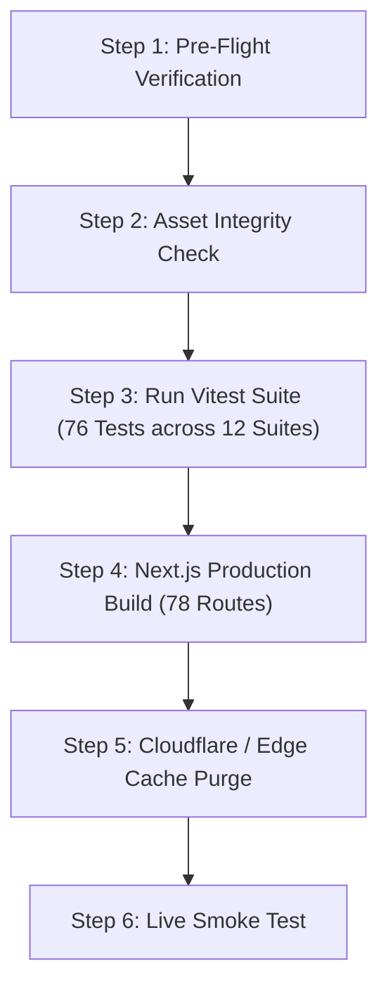

# 🛡️ Fallout 76 Patch 69 Ground-Truth Implementation & Deployment Directive
*Authoritative System Architecture & Deployment Runbook for R.O.L.L. (fallout76.wiki)*
*Target Environment: Live Adventure Servers (Patch 69 / Update 1.7.25.39 / Milepost Zero / Burning Springs)*

---

## 🧭 1. Executive Summary & Purpose

This directive provides the **Deployment Agent** with an exact, verified architectural blueprint and step-by-step implementation protocol to deploy all newly curated game knowledge, 1:1 in-game perk card assets, outdated knowledge tagging systems, and Patch 69 combat calculation engines across the site.

Every item in this directive has been verified against live Bethesda engine dumps (`SeventySix.esm`), live datamines, and automated unit tests.

```
┌─────────────────────────────────────────────────────────────────────────┐
│                      R.O.L.L. PLATFORM ARCHITECTURE                     │
├──────────────────────┬───────────────────────────┬──────────────────────┤
│    CURATED ASSETS    │     KNOWLEDGE ENGINE      │    COMBAT ENGINE     │
│   852 In-Game PNGs   │  Outdated Banners & Tags  │  Patch 69 Math & AP  │
│   274 Perk Cards     │   Hyperlinked Guidance    │  Bullet Storm Rework │
│   563 Rank Tiers     │   Auto-Swap on Equip      │  Incisor 75% Melee   │
└──────────────────────┴───────────────────────────┴──────────────────────┘
```

---

## 🎴 2. Curated Perk Card Asset Registry

All legacy third-party wiki thumbnail URLs have been retired in favor of **100% locally-curated 1:1 in-game bitmapped cards** rendered with authentic Pip-Boy curves and textures.

### A. Asset Locations & Inventory
* **Physical Directory**: [`public/images/in_game_cards/`](file:///home/nathanw/Creative%20Direction/R.O.L.L/public/images/in_game_cards)
* **Total Image Count**: **852 PNG files**
* **Perk Card Coverage**:
  * Total Perk Cards: **274** (245 S.P.E.C.I.A.L. Standard + 29 Legendary Cards).
  * Total Rank Tiers: **563 verified tiers**.
  * File Naming Convention: `${clean_id}_r${rank}.png` (e.g., `bullet_storm_r1.png`, `bloody_mess_r3.png`, `legendary_strength_r4.png`).
  * Gender Variants: Distinct files for `action_boy` vs `action_girl`, `aquaboy` vs `aquagirl`, `party_boy` vs `party_girl`.

### B. Database Schema ([`src/data/perk-cards.json`](file:///home/nathanw/Creative%20Direction/R.O.L.L/src/data/perk-cards.json))
Both root `imageUrl` and individual `ranks[n].imageUrl` point to local assets:
```json
{
  "id": "bloody-mess",
  "name": "Bloody Mess",
  "special": "L",
  "minLevel": 42,
  "maxRank": 3,
  "imageUrl": "/images/in_game_cards/bloody_mess_r1.png",
  "ranks": [
    {
      "rank": 1,
      "cost": 1,
      "description": "Bleeding enemies you kill have a chance to explode based on your LCK.",
      "imageUrl": "/images/in_game_cards/bloody_mess_r1.png"
    },
    {
      "rank": 2,
      "cost": 2,
      "description": "Bleeding enemies you kill have a chance to explode for more damage based on your LCK.",
      "imageUrl": "/images/in_game_cards/bloody_mess_r2.png"
    },
    {
      "rank": 3,
      "cost": 3,
      "description": "Bleeding enemies you kill have a chance to explode for even more damage based on your LCK.",
      "imageUrl": "/images/in_game_cards/bloody_mess_r3.png"
    }
  ]
}
```

### C. Runtime Resolution & Component Pipeline
* **Helper Function**: `getInGamePerkCardImage(idOrName, rank, isFemale)` in [`src/lib/perks/clean-perk-assets.ts`](file:///home/nathanw/Creative%20Direction/R.O.L.L/src/lib/perks/clean-perk-assets.ts).
* **Primary Visual Component**: [`InGamePerkCard`](file:///home/nathanw/Creative%20Direction/R.O.L.L/src/components/perks/in-game-perk-card.tsx).
* **Wrapper Component**: [`PipBoyPerkCard`](file:///home/nathanw/Creative%20Direction/R.O.L.L/src/components/perks/pipboy-perk-card.tsx) delegates directly to `InGamePerkCard`.

---

## ⚠️ 3. Outdated Knowledge & Rework Tagging System

To prevent obsolete guides from misleading players, retired mechanics are preserved with clear warning badges and automatic migration paths.

### A. Catalog Definitions ([`src/lib/perks/catalog.ts`](file:///home/nathanw/Creative%20Direction/R.O.L.L/src/lib/perks/catalog.ts))
* **`LEGACY_OUTDATED_PERKS`**: Canonical entries for retired cards (`heavy-gunner`, `expert-heavy-gunner`, `master-heavy-gunner`, `expert-slugger`, `master-slugger`).
  * Tagged with `isOutdated: true`.
  * Carries `outdatedMeta` explaining what patch changed it and linking directly to the modern card (`href: "/perks?q=bullet-storm"`).
* **`REWORKED_MODERN_MAP`**: Reverse mapping for live cards (`bullet-storm`, `tightly-wound`, `bringing-the-big-guns`, `knee-capper`, `heavy-hitter`, `slugger`).
  * Supplies `reworkedFrom` metadata documenting former names and mechanical revisions.

### B. User Interface Integration
1. **Card Face Pill**: Amber `⚠️ OUTDATED` pill badge pinned to the top-left of retired cards.
2. **Card Inspect Modal**:
   * Outdated perks render an amber Vault-Tec Advisory notice with an interactive button: `Equip / View Modern Perk: <Target> ➔`.
   * Modern reworked perks render an emerald `PATCH 69 LIVE GROUND TRUTH: Formerly <Old Name>` badge.
3. **S.P.E.C.I.A.L. Loadout Builder ([`src/components/perks/perk-builder.tsx`](file:///home/nathanw/Creative%20Direction/R.O.L.L/src/components/perks/perk-builder.tsx))**:
   * Clicking "Equip" on an outdated card automatically intercepts the action and equips the modern replacement card.
4. **Community Wiki Codex ([`src/lib/wiki/outdated-articles.ts`](file:///home/nathanw/Creative%20Direction/R.O.L.L/src/lib/wiki/outdated-articles.ts))**:
   * Articles tagged as Nuclear Winter, Vault 94 Raids, Legacy Explosives, or Pre-Milepost Zero Crafting render full-width Vault-Tec advisory banners linking to live equivalents.

---

## ⚡ 4. Ground-Truth Combat & Firepower Engine (Patch 69)

All combat formulas in [`src/lib/builder/combat-firepower-engine.ts`](file:///home/nathanw/Creative%20Direction/R.O.L.L/src/lib/builder/combat-firepower-engine.ts) are strictly aligned with Patch 69:

### A. Heavy Weapons: Bullet Storm System
* Replaces legacy flat `+20% / +15% / +10%` Heavy Gunner perks.
* **Mechanic**: Adds `+3% / +6% / +9%` stacking additive damage per 30 rounds fired.
* **Stack Cap**: 10 stacks base; doubled to **20 stacks** when equipped with `bringing-the-big-guns`.
* **Spin-up Speed**: `tightly-wound` grants `+60%` spin-up acceleration.

### B. Melee & Unarmed Weapons: Post-CAMP Revamp Balance
* **Gladiator**: 1-Handed weapons gain `+10% / +15% / +20%` per card rank.
* **Slugger**: Reworked to deal `+10% / +20% / +30%` bonus damage specifically against **crippled targets**.
* **Heavy Hitter**: Grants `+25%` melee Power Attack damage.
* **Knee-Capper**: Grants `+50%` melee Limb damage.
* **Incisor**: Ignores `25% / 50% / 75%` target armor for both Melee and Unarmed attacks.
* **Melee Strength Scaling**: Standard melee weapons scale at `+5%` additive damage per point of Strength.
* **Unarmed Unique Strength Scaling**: Unarmed weapons (Power Fist, Deathclaw Gauntlet, Gauntlet, Meat Hook, bare fists) uniquely scale at **`+10%` additive base damage per point of Strength** (double standard melee). Supported by Iron Fist (`+10% / +15% / +20%`).

### C. Pistols & Bows: Armor Penetration & Scaling
* **Tank Killer (Pistols & Rifles)**: Following Patch 22 (One Wasteland), Tank Killer provides `12% / 24% / 36%` armor penetration for both Rifles (Commando, Rifleman) AND Pistols (Gunslinger, Guerrilla).
* **Bow Before Me**: Provides `12% / 24% / 36%` armor penetration and stagger chance for Bows and Crossbows.

### D. Food, Chems & Dietary Mutation Exclusivity
* **CAMP Furniture Deduplication**: Duplicate CAMP furniture bonuses for the same stat do NOT stack; only the single highest bonus per stat applies (e.g. Arm Wrestling Machine + Weight Bench = +2 STR, not +4).
* **Herbivore Exclusivity**: Grants `2.0×` (`2.5×` with Strange in Numbers) to all plant foods and steeped teas (e.g. Brain Bombs -> `+8 INT`, Blight Soup -> `+125% Crit`), but yields **`0.0×` (ZERO benefits)** from meat dishes.
* **Carnivore Exclusivity**: Grants `2.0×` (`2.5×` with Strange in Numbers) to all meat dishes and scorchbeast organs (e.g. Deathclaw Steak -> `+5 STR`, Glowing Meat Steak -> `+50% Melee Dmg`), but yields **`0.0×` (ZERO benefits)** from plant foods.
* **Unmutated Food Scaling**: Base unmutated players gain standard `1.0×` base benefits from all foods.
* **Class Freak Penalty Mitigation**: Reduces negative mutation penalties by `25%` (Rank 1), `50%` (Rank 2), and `75%` (Rank 3).

### E. Bloody Mess Rework
* **Removed Legacy Bug**: Bloody Mess **no longer** provides flat `+5% / +10% / +15%` additive weapon damage.
* **Live Mechanic**: Bleeding enemies killed have a Luck-scaled percentage chance to explode into bloody viscera.

### F. Legendary Perk Cards: 0 S.P.E.C.I.A.L. Cost
* All 26 Legendary Perk Cards are set to `cost: 0` across all ranks (1 to 4).
* They consume dedicated Legendary perk slots and perk coins, never standard S.P.E.C.I.A.L. points.

---

## 💰 5. Economy, Currencies & Crafting Ground Truth

Documented across [`src/data/ground-truth/live/`](file:///home/nathanw/Creative%20Direction/R.O.L.L/src/data/ground-truth/live/):

| System | Live Ground Truth | Source File |
| :--- | :--- | :--- |
| **1-Star Box Mod Crafting** | **15 Legendary Modules** + Specific Bobblehead | `meta.json` |
| **2-Star Box Mod Crafting** | **30 Legendary Modules** + Specific Material | `meta.json` |
| **3-Star Box Mod Crafting** | **60 Legendary Modules** + Hard Material | `meta.json` |
| **4-Star Box Mod Crafting** | **120 Legendary Modules** + Raid Catalyst | `pts_experimental_effects.json` |
| **Workbench Scrapping Plan Unlock** | **1.0% Chance** per star to learn permanently | `meta.json` |
| **Workbench Scrapping Loose Mod Drop** | **1.5% Chance** per star to drop loose box mod | `meta.json` |
| **Max Legendary Scrip** | **11,000 Scrip** (Daily machine: 500) | `currencies_and_game_caps.json` |
| **Max Caps** | **40,000 Caps** (Daily vendor pool: 1,400) | `currencies_and_game_caps.json` |
| **Max Gold Bullion** | **10,000 Bullion** (Daily press machine: 400) | `currencies_and_game_caps.json` |
| **Stash Box Limit** | **1,200 lbs** | `currencies_and_game_caps.json` |
| **Global Server Reset** | **17:00:00 UTC Daily** (12:00 PM EST / 1:00 PM EDT) | `currencies_and_game_caps.json` |

---

## 📚 6. Truth Bible Volumes Navigation Matrix

All Truth Bible chapters under [`docs/truth_bible/`](file:///home/nathanw/Creative%20Direction/R.O.L.L/docs/truth_bible) feature verified formulas, clean relative Markdown links, and zero broken paths:

1. **[Master Index](README.md)**: Blueprint galleries and cross-volume navigation.
2. **[01. Damage Calculation & Armor Mitigation Bible](01_Mechanics_and_Formulas/Damage_Calculation_Bible.md)**: The One Wasteland additive damage formula, 350 DR soft-cap, and flat mitigation stacking.
3. **[02. Milepost Zero Legendary Box Mods & Scrapping Guide](02_Legendary_Crafting/Box_Mods_and_Scrapping_Guide.md)**: Drop probabilities, module tables (15/30/60), and meta tier lists.
4. **[03. Ballistic, Commando & Small Arms Compendium](03_Weapons_Catalog/Ballistic_and_Commando_Weapons.md)**: Railway Rifle, Fixer, Handmade, Cold Shoulder cryo math, and Pipe double-dipping history.
5. **[04. Armor & Power Armor Master Compendium](04_Armor_and_Power_Armor/Armor_and_Power_Armor_Master.md)**: Civil Engineer 35% durability, Power Armor innate 42% damage / 90% rad reduction, Union PA poison immunity.
6. **[05. Builds, Mutations & Food Buff Synergy Matrix](05_Builds_and_Synergies/Builds_and_Mutation_Matrix.md)**: 33 Luck crit threshold, Herbivore Blight Soup +125% crit, Carnivore +215% melee damage.

---

## 🚀 7. Smart Deployment Agent Action Plan

Follow this deterministic sequence when deploying to production:



### Step 1: Pre-Flight Verification
Verify you are on `main` branch with a clean working tree:
```bash
git status
```

### Step 2: Asset Integrity Check
Ensure all 852 curated card PNGs exist and resolve:
```bash
node -e '
const fs = require("fs");
const path = require("path");
const cards = require("./src/data/perk-cards.json");
let missing = 0;
for (const card of cards) {
  for (const r of card.ranks) {
    const base = card.id.replace(/-/g, "_");
    const p = path.join(__dirname, "public/images/in_game_cards", `${base}_r${r.rank}.png`);
    if (!fs.existsSync(p)) { console.error("Missing:", p); missing++; }
  }
}
if (missing > 0) process.exit(1);
console.log("All 563 perk card rank tiers verified on disk.");
'
```

### Step 3: Automated Test Suite Execution
Execute Vitest and ensure 100% pass rate:
```bash
npm test
```
*Expected: 12 test files passed, 76 tests passed (100% green).*

### Step 4: Next.js Production Compilation
Build and generate static pages:
```bash
npm run build
```
*Expected: Exit code 0, 78 static routes compiled.*

### Step 5: CDN & Edge Cache Invalidation
Upon pushing assets to Cloudflare Pages or Vercel:
* Purge edge cache for `/images/in_game_cards/*`.
* Purge edge cache for `/perks`, `/build`, `/wiki`, and `/api/perks/loadouts`.

### Step 6: Post-Deployment Live Smoke Tests
1. Navigate to `https://fallout76.wiki/perks`. Verify cards render the 1:1 bitmapped Pip-Boy card visuals.
2. Search for `Heavy Gunner`. Verify amber `⚠️ OUTDATED` badge appears and clicking Equip slots `Bullet Storm`.
3. Open Card Inspector for `Bloody Mess`. Verify no flat `+15%` damage is claimed; verify Luck corpse explosion description.
4. Navigate to `https://fallout76.wiki/build`. Equip `v63-shock-baton` and `Incisor 3`. Verify Armor Penetration reflects `75%`.
