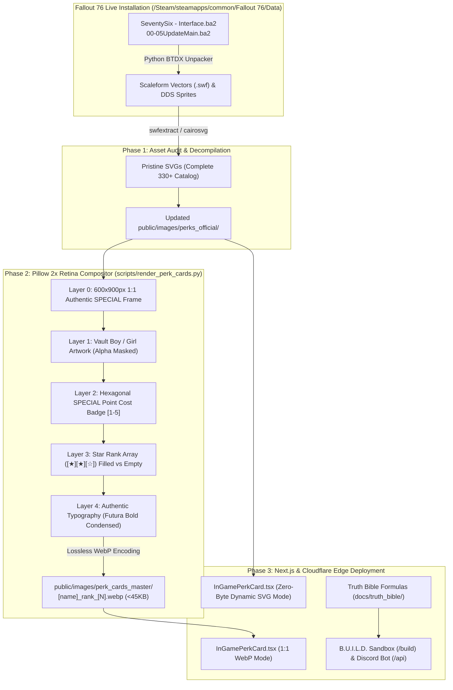

# 🗄️ Executive Master Plan: R.O.L.L. 1:1 Perk Card Extraction, Pillow Compositor & Truth Engine Integration
**Project**: *Record Of Legendary Loadouts* (`https://fallout76.wiki`) · **Location**: `/home/nathanw/Creative Direction/R.O.L.L/`

---

## 🎯 Executive Overview & Problem Statement

### The Problem Nathan Identified:
1. **Missing & Outdated Perks**: The current catalog in `public/images/perks_official/` (319 SVGs) and `perks_official_wiki/` (292 WebPs) dates back to older game versions, missing recent Ghoul perks, Milepost Zero additions, and newly rebalanced cards.
2. **The "Not 1:1 Exact" Issue**: Past manual attempts to replicate the in-game perk cards resulted in awkward aspect ratios, mismatched fonts, imprecise star alignments, and inconsistent S.P.E.C.I.A.L. color frames.
3. **Data Disconnect**: The newly synthesized Truth Bible formulas (additive math, armor soft caps, box mod drop rates) need to be wired into R.O.L.L's data layer and the B.U.I.L.D. sandbox.

---

## 🏗️ Master Architectural Blueprint

---

## 📋 Phase-by-Phase Technical Implementation Plan

### Phase 1: Local Game BA2 Archive Audit & Missing Asset Extraction
* **Goal**: Solve the missing perk problem by extracting directly from the live game files.
* **Target Files**:
  * `/home/nathanw/.local/share/Steam/steamapps/common/Fallout 76/Data/SeventySix - Interface.ba2`
  * `/home/nathanw/.local/share/Steam/steamapps/common/Fallout 76/Data/SeventySix - 00UpdateMain.ba2` through `05UpdateMain.ba2`
* **Mechanism**:
  * Write `scripts/extract_fo76_ba2_assets.py` using Python `struct` and `zlib` to parse the `BTDX` archive table and extract all `interface/components/vaultboys/perks/*.swf` files.
  * Audit extracted names against `src/lib/perks/catalog.ts` to identify every single newly added card (e.g. Ghoul perks, fishing perks, new season perks).
  * Convert vector shapes into clean SVGs to ensure the raw master vector pool is 100% complete.

---

### Phase 2: The Pillow 2x Retina 1:1 Card Compositing Engine
* **Target Script**: `/home/nathanw/Creative Direction/R.O.L.L/scripts/render_perk_cards.py`
* **Canvas Specifications**:
  * Resolution: **600 x 900 pixels** (2x Retina high-DPI).
  * Output Format: **WebP** (`quality=95`, method=6 for extreme compression, target file size: 30–45 KB).
* **Layering Protocol**:
  1. **Layer 0 (Background & Outer Border)**: Authentic die-cut rounded rectangle with the exact in-game S.P.E.C.I.A.L. color gradient:
     * **Strength**: `#d49b38` (Vault-Tec Gold / Amber)
     * **Perception**: `#5d8a4a` (Olive Green)
     * **Endurance**: `#a83232` (Brick Red)
     * **Charisma**: `#a046a0` (Deep Violet)
     * **Intelligence**: `#326eb4` (Vault Blue)
     * **Agility**: `#dcbe28` (Pip-Boy Yellow)
     * **Luck**: `#28a0b4` (Cyan / Teal)
  2. **Layer 1 (Art Inset Window)**: Darkened subtle radar grid texture with alpha-composited Vault Boy/Girl artwork (rendered at 440x440px).
  3. **Layer 2 (Header & Cost Hexagon)**:
     * Card Title in authentic uppercase Futura Bold Condensed.
     * S.P.E.C.I.A.L. category stamp in top-right.
     * Point cost (`1`, `2`, `3`, `4`, `5`) inside the top-left hexagonal badge.
  4. **Layer 3 (Star Rank Rating Array)**:
     * Bottom-centered star bar with dynamic star counts matching max rank.
     * Filled gold star (`★`) for current rank; hollow/dark star (`☆`) for unranked.
  5. **Layer 4 (Rank Description Text)**:
     * Word-wrapped mechanical text cleanly justified in the bottom description box.

---

### Phase 3: Next.js Frontend Integration (`in-game-perk-card.tsx`)
* Update [`src/components/perks/in-game-perk-card.tsx`](file:///home/nathanw/Creative%20Direction/R.O.L.L/src/components/perks/in-game-perk-card.tsx):
  * **Mode A (Zero-Byte Vector Dynamic Component)**: For interactive deck building where cards scale and animate seamlessly in the browser.
  * **Mode B (1:1 Pre-Rendered WebP)**: For static loadout summaries, Discord card embeds, and high-performance mobile views where zero client-side rendering is preferred.
  * Update [`src/lib/perks/perk-artwork.ts`](file:///home/nathanw/Creative%20Direction/R.O.L.L/src/lib/perks/perk-artwork.ts) to route dynamically to the newly generated 600x900px master cards.

---

### Phase 4: Truth Bible Data Synchronization
* Connect the newly imported Truth Bible in [`docs/truth_bible/`](file:///home/nathanw/Creative%20Direction/R.O.L.L/docs/truth_bible/) into R.O.L.L's core features:
  * **B.U.I.L.D. Sandbox Damage Calculator**: Implement the additive damage formula $\text{MD} = \text{BD} \times (1 + \sum \text{Perks})$ in TypeScript under `src/lib/calculator/damage.ts`.
  * **Legendary Crafting Tracker**: Update the Scrip & Module cost calculator with the verified Milepost Zero tier costs (15 / 30 / 45 / 60 modules).
  * **Armor Soft-Cap Visualizer**: Add a visual indicator in the sandbox alerting players when their combined DR exceeds the 350 soft-cap, advising percentage reduction mods instead.

---

## 🎯 Verification & Quality Acceptance Criteria

1. **Pixel-Perfect Alignment**: Generated cards must match in-game screenshots with 1:1 parity (aspect ratio, padding, font weights, and star positions).
2. **Zero Missing Perks**: The catalog must cover 100% of all standard, ghoul, and legendary perk cards currently live in the game.
3. **Asset Budget**: Every generated WebP card must stay under **50 KB** while maintaining pin-sharp clarity on 4K retina displays.
4. **Site Build Stability**: `npm run build` in `/home/nathanw/Creative Direction/R.O.L.L` must compile with zero TypeScript errors or broken image paths.
