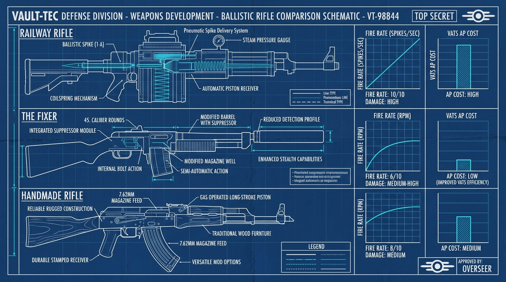

# 🔫 Ballistic, Commando & Small Arms Master Compendium
*Exhaustive, verified weapon breakdowns from S-Tier DPS gods to humble Appalachian pipe guns.*

---

## 🚂 1. Railway Rifle (The Reigning DPS Monster)

* **Ammo Type**: Railway Spikes (Crafted using only Steel; recover from dead targets).
* **Firing Mechanism**: Automatic Piston Receiver transforms it from a clunky rifle into a steam-powered sub-second burst cannon.
* **Recoil Characteristic**: **Severe Vertical Kick**. Firing outside of V.A.T.S. is impossible; it is strictly a 100% V.A.T.S. weapon.
* **Patch Balance Status**: Recent updates normalized fire rate curves and adjusted AP consumption. A **Quad** prefix is mandatory due to the small base 10-round magazine.
* **God-Roll Blueprint**:
  * $\bigstar$ **Quad**
  * $\bigstar\bigstar$ **Rapid (+25% FFR)** or **Vital (+50% Crit Damage)**
  * $\bigstar\bigstar\bigstar$ **V.A.T.S. Optimized (-25% AP Cost)** or **Durability (+50% Break Slower)**
* **Ideal Mods**: Automatic Piston Receiver, Long Barrel, Recoil Compensating Stock, Reflex Sight.

---

## 🕵️ 2. The Fixer (The Stealth Operative King)

* **Ammo Type**: .45 Rounds (or Prime Ultracite .45).
* **Innate Property**: Modified Combat Rifle frame that grants **Sneak Speed bonus** and **Reduced Detection Profile**.
* **Stealth Multiplier**: Stacks natively with **Covert Operative** ($2.5\times$), **Mister Sandman** ($3.5\times$ at night), and Suppressor mods.
* **God-Roll Blueprint**:
  * $\bigstar$ **Quad** (for bosses) or **Bloodied / Anti-Armor** (for mob clearing)
  * $\bigstar\bigstar$ **Explosive** or **Vital (+50% Crit Damage)** or **Rapid (+25% FFR)**
  * $\bigstar\bigstar\bigstar$ **V.A.T.S. Optimized (-25% AP Cost)**
* **Ideal Mods**: Tweaked Automatic Receiver (best crit bonus), Aligned Long Barrel, Forceful Stock (maximum durability), Perforating Magazine (40% armor pen), Reflex Sight, Suppressor.

---

## 🛠️ 3. Handmade Rifle (The Precision Workhorse)

* **Ammo Type**: 5.56 Rounds.
* **Characteristics**: Slower fire rate than The Fixer, but possesses **far superior manual recoil stabilization**, making it the best hybrid rifle for players who like free-aiming outside V.A.T.S.
* **God-Roll Blueprint**:
  * $\bigstar$ **Anti-Armor** or **Bloodied** or **Quad**
  * $\bigstar\bigstar$ **Rapid (+25% FFR)** or **Explosive**
  * $\bigstar\bigstar\bigstar$ **Swift (+15% Reload)** or **V.A.T.S. Optimized**

---

## 🪵 4. Appalachian Pipe Guns (The Junk Scrap Masters)

Yes, even Appalachia's most degraded plumbing has a place in the Truth Bible:

| Weapon | Base Damage | Fire Rate | Historical / Practical Mechanics |
| :--- | :--- | :--- | :--- |
| **Pipe Bolt-Action** | 65 (Ballistic) | 12 RPM | *Legacy Double-Dip*: Historically double-dipped in both Rifleman AND Gunslinger perks when fitted with a rifle stock. Now patched into strict class separation. Hits hard per shot but suffers heavy bolt rechamber cycle. |
| **Pipe Revolver** | 50 (Ballistic) | 36 RPM | Medium-range, high single-shot punch. Can be suppressed. Fun for budget western stealth builds. |
| **Automatic Pipe Gun** | 13 (Ballistic) | 75 RPM | Uses common .38 ammo. Extremely cheap repair costs. Excellent budget tagging tool for early-game players. |

---

## ❄️ 5. Cold Shoulder & Shotgun Dynamics

* **Cold Shoulder (Unique Double-Barrel Shotgun)**:
  * Inherent Cryo Damage + High Pellet Count + Innate $+50\%$ damage against Cryptids.
  * **Freezing Mechanic**: Chills raid bosses (Earle, Queen, Titan), dropping their movement and attack animations to a crawl.
  * **Perk Synergy**: Combine with **Enforcer (Rank 3)** to instantly cripple Queen wings with a single 8-pellet spread, forcing her to land immediately.

---

## 👽 6. Small Arms & Pistols (Gunslinger Domain)

* **Alien Blaster (Cryo Mag)**: Fires superheated plasma bolts. The Cryo Receiver adds an explosive splash radius. Best in slot for Gunslingers.
* **Crusader Pistol**: Brotherhood tech capable of swapping receivers: 5.56mm, Fusion, Cryo, or Pyro. Pyro receiver synergizes with **Friendly Fire** perk to heal NPC event escorts!

---
*Cross-References*: [Master Truth Bible](../README.md) | [01. Damage Calculation & Armor Mitigation Bible](../01_Mechanics_and_Formulas/Damage_Calculation_Bible.md) | [02. Box Mods & Scrapping Guide](../02_Legendary_Crafting/Box_Mods_and_Scrapping_Guide.md) | [04. Armor & Power Armor Master](../04_Armor_and_Power_Armor/Armor_and_Power_Armor_Master.md) | [05. Builds & Mutation Matrix](../05_Builds_and_Synergies/Builds_and_Mutation_Matrix.md)
