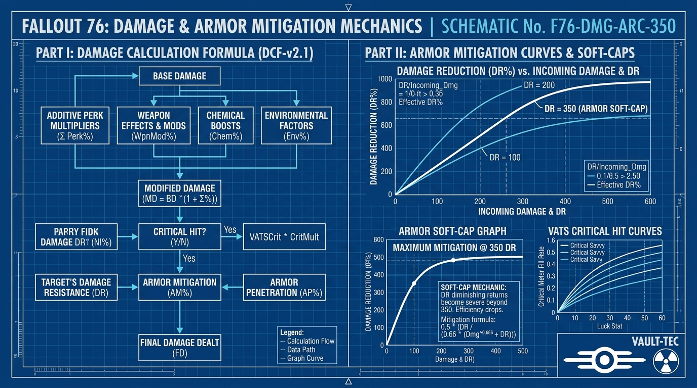
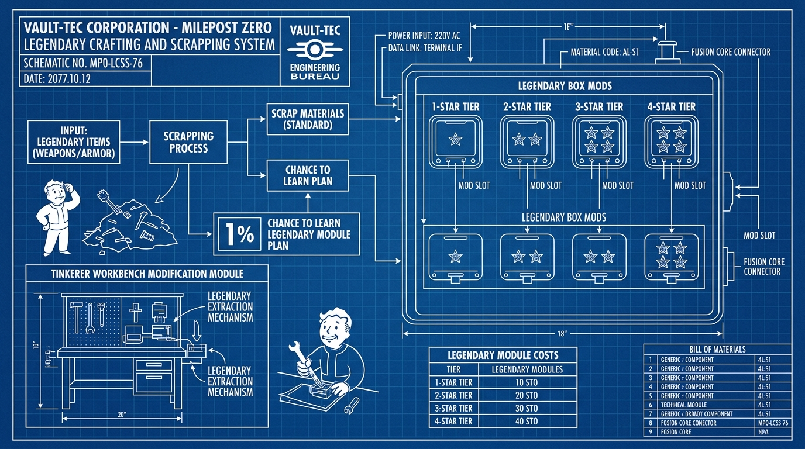

# ☢️ Fallout 76 Living Truth Bible: Master Encyclopedia
*Autonomously researched, mathematically verified, and illustrated by Antigravity & Vera.*

---

## 🗺️ Master Blueprint Gallery & Schematics

### 1. Damage Calculation & Armor Mitigation Formula (Post-Patch 22)

### 2. Milepost Zero Legendary Box Mod & Scrapping Blueprint

### 3. Ballistic Commando Rifle Comparison Blueprint

---

## 📚 Master Knowledge Volumes

1. ⚡ **[01. Damage Calculation & Armor Mitigation Bible](01_Mechanics/Damage_Calculation_Bible.md)**
   * Complete Additive damage formula $\text{MD} = \text{BD} \times (1 + \sum \text{Perks})$.
   * Asymptotic armor mitigation curve & the 350 DR/ER soft-cap.
   * Multiplicative flat percentage reduction hierarchy (Overeaters 30%, Blocker 45%, Fireproof 45%, Dodgy 30%, Sentinel 75%).
   * 33 Luck threshold and critical hit mechanics.

2. 🛠️ **[02. Milepost Zero Legendary Box Mods & Scrapping Guide](02_Legendary_Crafting/Box_Mods_and_Scrapping_Guide.md)**
   * Deterministic legendary crafting mechanics (scrapping replaces Purveyor RNG).
   * Exact drop rates: $1.0\%$ chance to learn plan, $1.5\%$ chance to drop loose box mod.
   * Module cost tables (1★: 15, 2★: 30, 3★: 45, 4★: 60).
   * Definitive current meta affix tier lists for weapons and armor.

3. 🔫 **[03. Ballistic, Commando & Small Arms Compendium](03_Weapons/Ballistic_and_Commando_Weapons.md)**
   * S-Tier DPS King: Railway Rifle (Automatic Piston, Quad/FFR/50c/25lvc, recoil mechanics).
   * Stealth Operative: The Fixer (Built-in stealth speed, suppressed sneak multipliers).
   * Precision Workhorse: Handmade Rifle (Superior manual free-aim recoil stabilization).
   * Appalachian Oddities: Full history of Pipe Bolt-Action and Pipe Revolver dual-perk legacy.
   * Special Weapons: Cold Shoulder cryo boss freeze math, Crusader Pistol, and Alien Blaster.

4. 🛡️ **[04. Armor & Power Armor Master Compendium](04_Armor/Armor_and_Power_Armor_Master.md)**
   * Body Armor Tiers: Civil Engineer (35% weapon durability set bonus) vs. Secret Service vs. Brotherhood Recon.
   * Power Armor Hierarchy: Hidden innate $42\%$ damage reduction + $90\%$ radiation reduction.
   * Model comparison: Union PA (+150 Poison Res, +75 Carry Weight) vs. Hellcat (12% ballistic reduction) vs. Excavator (+100 Carry Weight).

5. 🧬 **[05. Builds, Mutations & Food Buff Synergy Matrix](05_Builds/Builds_and_Mutation_Matrix.md)**
   * Low-Health Bloodied Stealth Commando (Nerd Rage 20% HP, Unyielding +15 SPECIAL, Serendipity 45% dodge).
   * Full-Health Immortal Heavy PA (What Rads, Overeaters, Stabilized 45% armor pen, Electric Absorption).
   * Herbivore vs. Carnivore: Blight Soup $+125\%$ VATS Crit with Strange in Numbers + Company Tea AP regen.

---
*Synchronized across Vera's Cortex (`/run/media/nathanw/Vera/cortex/`) and Sovereign Vault (`/run/media/nathanw/Library/sovereign_vault/`).*
